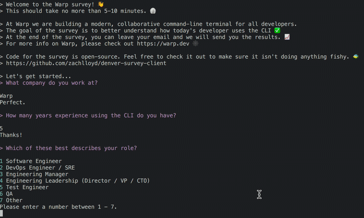

# tl; dr: To install and run
It should take only 5-10 minutes.

Just run 
```
curl -s https://raw.githubusercontent.com/warpdotdev/warp-cli-survey/master/install.sh | bash && /tmp/dsurvey
```

# Here's what the survey looks like


# What is Warp?
Warp is re-imagining the command-line terminal as a modern, collaborative app.  

The core of Warp will be a new, open-source terminal. It's not ready just yet.

You can sign up to follow progress at https://warp.dev

# What is this code I'm about to run...
This repo contains code for the Warp CLI survey.  The survey asks a number of questions about command-line usage (see below for full list).  The goal is to put together some concrete data to help drive product direction.

You only should be running this if you have some connection to Warp or someone you trust asked you to fill it out.

It's open source so that you can look at the code yourself and make sure we aren't doing anything fishy 🐠

We will keep this data confidential, but will share an aggregate data set once we have enough samples.

By filling it out, you are helping us build a better product, and we very much appreciate that.

If you want more info, please email zach@warp.dev

# What personal info does it collect?
Only what you tell us.

Leaving your email is optional - so feel free to omit if you want the survey results to be *anonymous*.  But if you leave it we will send you your results and a view of the aggregate data as well.

Uploading your shell history is also optional.  If you do upload it, we *redact* all arguments and flag values first.

# Why is this built as a CLI app rather than a SurveyMonkey or Typescript form?

In order to make it easy to upload a redacted version of your shell history.

# What should I expect

Here is the current list of questions:
1. What company do you work at?
2. How many years experience using the CLI do you have?
3. Which of these best describes your role?
4. What type of computer do you write code on?
5. What platforms do you primarily develop for?
6. Can we take a look at your shell history to get a better sense of how you use the CLI? We will strip out all sensitive information first.
7. What terminal do you typically use?
8. How experienced of a command-line user are you?"
9. How often do you use the command-line?
10. How many terminal windows or tabs do you usually have open?
11. How many different git repos are you typically working with?
12. What code editors or IDEs do you typically use?
13. Which of the following applications / platforms / configurations do you use to improve your experience in the command-line?
14. What would you most like to see improved in the command-line experience?
15. What's your biggest pain point working in the command-line?
16. Is there an improvement to the command-line you would pay $10 / mo for?  If so, please tell us about it.
17. Could we have your email to send you the survey results?
18. We'd love to reach out and pick your brain on the product - is that OK?
